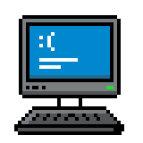

# Developer Battle

Developer Battle est un jeu de rôle de combat au tour par tour inspiré des classiques du genre, où vous incarnez un développeur web qui doit maîtriser différents langages pour vaincre ses ennemis et restaurer l'équilibre numérique.




## Présentation

Developer Battle est un jeu de rôle en français où vous incarnez un développeur qui doit maîtriser différentes technologies web (HTML, CSS, JavaScript) pour combattre des ennemis qui menacent le monde numérique. Chaque technologie a ses propres attaques et spécificités, et chaque ennemi a ses faiblesses particulières.

Le jeu propose actuellement 4 niveaux, avec un système de progression qui permet de débloquer de nouveaux niveaux à mesure que vous avancez.

## Installation

Pour installer et lancer le projet localement :

```bash
# Cloner le dépôt
git clone https://github.com/Chocoshed/react-developer-rpg-game.git
cd react-developer-rpg-game

# Installer les dépendances
npm install

# Lancer le serveur de développement
npm run dev

# Construire pour la production
npm run build
